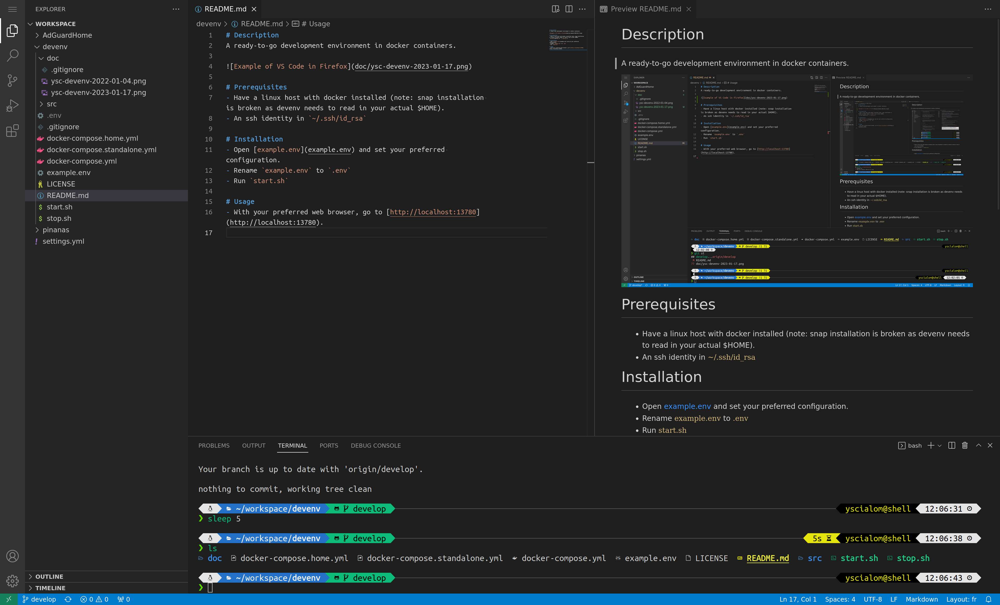

# Description
A ready-to-go development environment in docker containers.

# Prerequisites
- Have a linux host with docker installed (note: snap installation is broken as devenv needs to read in your actual $HOME).
- An ssh identity in `~/.ssh/id_rsa`

# Installation
- Open [example.env](example.env) and set your preferred configuration.
- Rename `example.env` to `.env`
- Run `start.sh`

# Usage
- With your preferred web browser, go to [http://localhost:13780](http://localhost:13780).
